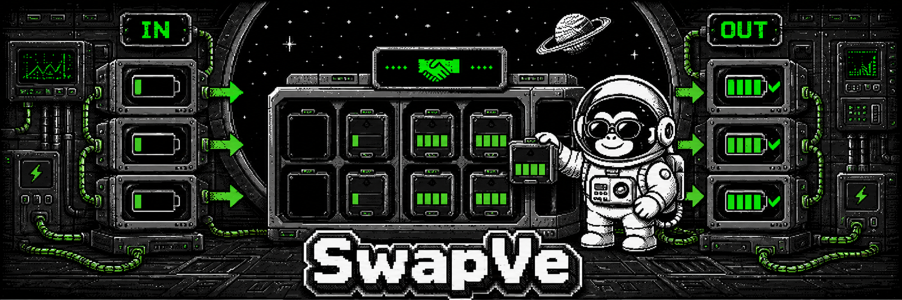

<p align="center">
  
</p>

<h1 align="center">SwapVe</h1>

<p align="center">
  <b>An OCPP 2.1 Battery Swap (Block S) library and test tooling for the JVM.</b><br>
  Codec and session layers, a swap domain model, a station simulator — and a reference CSMS.
</p>

<p align="center">
  <b>English</b> · <a href="README.ko.md">한국어</a>
</p>

<p align="center">
  <a href="https://github.com/ZANNABI-LAB/swapve/actions/workflows/ci.yml"></a>
  <a href="LICENSE"></a>
  
  
  
</p>

---

## What you get

**Four things you can take separately.** You are not expected to use all of them — that is the design.

| What | Module | Reach for it when |
|---|---|---|
| **OCPP 2.1 codec + session** | `ocpp-core` | You need OCPP-J framing and validation against the **181 official JSON schemas**. It knows nothing about frameworks |
| **Battery Swap domain** | `swap-domain` | You need the swap state machine, slot model, and invariants. No I/O at all |
| **Simulator + control console** | `station-sim`·`sim-console` | You want to **exercise your own CSMS against Block S**. Failure scenarios F1–F6 are one button each |
| **Reference CSMS** | `csms` | You want to see how the pieces fit. The conformance cases run against this |

> **This does not promise a finished CSMS.** `csms` is a reference implementation, not a product.
> The codec and schema layers **are callable from Java** — the session layer is Kotlin-only.
> That is measured, not assumed: see [LAYERS §4](docs/LAYERS.md).

**Not yet published to Maven Central.** For now you build from source ([B07](BACKLOG.md)).

## Quick start

All you need is **JDK 17 and git**. The Gradle wrapper fetches the rest.

```bash
git clone https://github.com/ZANNABI-LAB/swapve.git && cd swapve
./gradlew build          # full test suite + module boundary checks
```

**Terminal A** — the CSMS. You are ready when `Started CsmsApplicationKt` appears.

```bash
./gradlew :csms:bootRun --args="--csms.security.profile=NONE --csms.api.security.enabled=false"
```

**Terminal B** — a simulated station connects and **completes one battery swap**, then exits.

```bash
./gradlew :station-sim:run --args="--csms-url ws://localhost:8080/ocpp --station-id CS001 --request-id 1001"
```

```
station-sim → ws://localhost:8080/ocpp/CS001 (순서 In-Out, 배터리 2 개)
교환 완주: requestId=1001, 오간 메시지 42 건
```

<sub>The simulator's console output is currently Korean: *"swap complete: requestId=1001,
42 messages exchanged."* Log message localization is tracked with the docs under
[B06](BACKLOG.md).</sub>

**Terminal C** — query exactly what an app would see.

```bash
curl localhost:8080/api/swaps/CS001:1001      # one swap — SoC/SoH of both battery sets
curl localhost:8080/api/metrics/swaps         # success rate · duration · failure reasons
curl localhost:8080/api/stations/CS001/charging-transactions   # charging of the returned batteries (S04)
```

> The steps above are a local demo, so both authentication layers are turned down.
> **The operational defaults are Basic over WebSocket and Basic on the REST API**
> → [docs/CONFIGURATION.md](docs/CONFIGURATION.md)

<details>
<summary><b>Reverse-order swaps · CSMS-initiated swaps (S02) · the control console</b></summary>

The reverse order (`Out-In`) is equally standard and works as-is ([PLAN §4.6](docs/PLAN.md)):

```bash
./gradlew :station-sim:run --args="--csms-url ws://localhost:8080/ocpp --station-id CS001 --swap-order Out-In --request-id 1002"
```

**To start a swap from the CSMS side, the way an app would** (standard use case S02), run the
simulator in standby and trigger it over REST. The correlation number (`requestId`) is issued by
the CSMS here, and the station adopts it verbatim (S02.FR.02).

```bash
# Terminal B — do not self-start; wait for RequestBatterySwap
./gradlew :station-sim:run --args="--csms-url ws://localhost:8080/ocpp --station-id CS001 --remote-start"

# Terminal C — as if the driver scanned a QR code
curl -X POST localhost:8080/api/swaps -H 'Content-Type: application/json' \
     -d '{"stationId":"CS001","idToken":{"idToken":"RFID-0001","type":"ISO14443"}}'
```

**To drive it from a screen**, start the control console. It **adds to the CLI rather than
replacing it** — everything above still works:

```bash
./gradlew :sim-console:run --args="--port 8090 --csms-url ws://localhost:8080/ocpp"
```

Open `localhost:8090`, then **Connect → Start swap**. The **F1–F6 buttons** fire the failure
scenarios from [PLAN §5.4](docs/PLAN.md) — "reproduce an empty-inventory rejection" is one click.

- The page is **a single static HTML file** with no CDN, font, or framework links. The HTTP server
  is the JDK's own `com.sun.net.httpserver` — **it comes up with no network at all**
- **F1 (no battery available) is a CSMS-initiated scenario** (S02.FR.04), so the console goes into
  standby and prints the exact `curl` line to paste; the rejection reason then lands on screen
- There is a control API too — `POST /api/stations` · `POST /api/stations/{id}/swap`
  (body `{"fault":"F3"}` injects a fault) · `DELETE /api/stations/{id}` · `GET /api/state`

The console drives the *test rig*. It is not a CSMS and does not pretend to be one.
</details>

<details>
<summary><b>Measured run</b> — timings from actually following the steps above (2026-08-18)</summary>

| Step | Took | Observed |
|---|---|---|
| `./gradlew build` | 54s – 1m25s | 279 tests + 3 module boundary checks passed |
| `./gradlew :csms:bootRun` | ~20s after the command (server itself boots in 2.8s) | `Started CsmsApplicationKt` · `Tomcat started on port 8080` |
| `./gradlew :station-sim:run …` | 13s | `교환 완주: requestId=1001, 오간 메시지 42 건` (swap complete, 42 messages) |
| Confirmed on the CSMS side | — | `BatteryIn → HalfIn`, `BatteryOut → Completed` |

**Measured with Gradle dependencies already cached.** A first `./gradlew build` on a fresh clone
also downloads the Gradle distribution and dependencies; that part depends on your connection.
Excluding it, the whole thing is **under three minutes**.

The three `curl` calls were verified in a separate environment as well:

- `/api/swaps/CS001:1001` → `status: COMPLETED`, with `batteriesIn` (2, SoC 12/13%) and
  `batteriesOut` (2, SoC 95%) **both** present ([PLAN §11.2](docs/PLAN.md))
- `/api/metrics/swaps` → `successRate: 1.0`, duration percentiles, and `failures.byScenario`
  split across F1·F2·F3·F5 (F4 and F6 are idempotent, so they do not count as failures)
- `/api/stations/CS001/charging-transactions` → charging transactions per slot

`SwapApiTest`, `SwapMetricsApiTest`, and `ChargingApiTest` call the same endpoints inside a real
Spring context on every build.
</details>

## What this is not

**Not a production system.** The absences come first.

- **What is closed and what is still open differ.** WebSocket defaults to `BASIC`, the REST API has
  its own Basic realm, and `sim-console` binds to loopback. There is no mTLS (B12), no credential
  rotation, no rate limiting, no operational audit trail.
- **Single instance.** Horizontal scaling is not blocked — `stationId` serialization and TSIDs are
  already in place (§11.5) — but it is not implemented ([B11](BACKLOG.md)). Restarts *are* survived:
  raw OCPP messages persist to an event log (H2) and derived registries are rebuilt from that log at
  startup (`EventLogRecovery`). Data outside the retention windows (7 days recovery · 30 days audit)
  is not reconstructable.
- **Smart charging, tariffs, roaming, and horizontal scaling are out of scope**
  ([PLAN §3](docs/PLAN.md)). Not implemented — but **not designed out either** ([PLAN §11](docs/PLAN.md)).
- **No dashboard or UI.** Reading stops at REST.

## Why Block S

In January 2025, OCPP 2.1 formally absorbed the **Battery Swap functional block (Block S)**,
covering battery exchange for two- and three-wheelers (scooters, e-bikes) as well as full-size EVs.

**"Supports 2.1" is not this project's differentiator.** A re-check in August 2026 found several
implementations working on 2.1. The claim here is narrower: **no open-source project was found that
actually handles Block S** — neither on the server side, nor as tooling you can exercise Block S with.

| Project | Role | OCPP 2.1 | Block S |
|---|---|---|---|
| [SteVe](https://github.com/steve-community/steve) | CSMS (Java) | ❌ 1.6J only | ❌ |
| [CitrineOS](https://github.com/citrineos/citrineos) | CSMS (TypeScript) | roadmap, under "other topics" | not mentioned |
| [MaEVe](https://github.com/thoughtworks/maeve-csms) | CSMS (Go) | ❌ 1.6J + 2.0.1 | ❌ |
| [EVerest libocpp](https://github.com/EVerest/libocpp) | **Charger-side** library (C++) | "in development" | not mentioned |
| Solidstudio VCP | **CS simulator** | ✅ supported | undetermined |
| ocpp-rs | Library + simulator (Rust) | ❌ 1.6J / 2.0.1 | ❌ |
| tzi-OCTT | CSMS verification pytest suite | ❌ 2.0.1 / 1.6J | — |
| OCTT (official) | Conformance test tool — **paid subscription** | ❌ 2.0.1 / 1.6 | — |
| **SwapVe** | **Library + test tooling + reference CSMS** (Kotlin) | ✅ | ✅ |

The three markings mean different things. **❌** is confirmed unsupported; **"not mentioned"** means
the topic was not found in the project's docs or issues; **"undetermined"** means no basis was found
either way. The latter two are *not evidence of absence.*
**Corrections are welcome.** If you know an implementation that handles the Block S messages
(`RequestBatterySwap`, `BatterySwap` transaction events), please open an issue.

## Verification — three gates

The three gates **answer different questions**, which is why they were not merged into one
([PLAN §7.3](docs/PLAN.md)).

| Gate | Command | What it guarantees |
|---|---|---|
| **L1 unit** | `./gradlew build` | Frame round-trips · validation against the **181 official schemas** · state machine invariants · REST contracts. **Five module boundary checks** and **13 Java-interop tests** run alongside |
| **L2 conformance** | `./gradlew conformanceTest` | Official cases **`TC_S_102_CSMS` · `TC_S_103_CSMS` · `TC_S_104_CS`** plus failure scenarios **F1–F6** |
| **L3 load + audit** | `./gradlew auditTest` | **20 stations connected concurrently**, then an invariant audit that **rebuilds state from the event log** and compares it against the live registries |

`auditTest` does not just print pass/fail — it prints **how many items each check examined**, because
a bare "passed" is indistinguishable from a check that never ran. And **the audit is itself tested**:
deliberately corrupted logs must turn each item red.

> Sample output · success criteria S1–S7 · full conformance case list →
> **[docs/CONFORMANCE.md](docs/CONFORMANCE.md)**
> **Official OCTT certification has not been obtained** — it is paid and must go through an
> OCA-approved test lab. What is here is an **independent implementation** of the Part 6 cases.

## Layout

```
swapve/
├─ ocpp-core/      OCPP-J framing · official schema validation · session layer  (framework-agnostic)
├─ swap-domain/    Battery Swap domain · swap state machine · slot model        (no I/O)
├─ csms/           the control server — WebSocket · REST API · metrics
├─ station-sim/    station simulator — slots · batteries · fault injection      (zero dependencies)
├─ sim-console/    simulator control console — demo screen + control API        (JDK's own HTTP)
└─ java-compat/    Java interop gate — calls the codec/schema layers from Java  (tests only)
```

`ocpp-core` and `swap-domain` know nothing about frameworks. **That boundary is a build check, not a
comment** — five `check*` tasks run as part of `./gradlew build`. Dependencies flow one way,
`sim-console → station-sim → (ocpp-core, swap-domain)`, and **`csms` is not in that chain** — the
control server must never gain a dependency that lets it drive a station.

## REST API

The standard already defines the app scenario. **S02**: *"EV Driver requests CSMS to initiate a
battery swap **via a smartphone app, e.g. by scanning a QR code**."* So
`app → CSMS → RequestBatterySwap → station` is the standard use case. Building the app is out of
scope, but **its contract is designed**.

| Method | Path | Purpose |
|---|---|---|
| `POST` | `/api/swaps` | Start a swap — sends `RequestBatterySwapRequest` (S02) |
| `GET` | `/api/swaps/{id}` | Progress · **SoC/SoH of both battery sets** · ledger imbalance |
| `GET` | `/api/metrics/swaps` | Success rate · duration distribution · **failure reasons by F1–F6** |
| `GET` | `/api/stations/{id}/charging-transactions` | Charging of the returned batteries (S04) |

The full contract and the reasoning behind it (why "no battery available" is a 200 rather than a 5xx;
why the metrics avoid Micrometer) is in **[docs/API.md](docs/API.md)**.

## Documentation

| Document | Contents |
|---|---|
| [docs/LAYERS.md](docs/LAYERS.md) | **Layer boundaries** — the codec is I/O-agnostic, the session layer is coroutine-only. What you take on when you use this as a library |
| [docs/API.md](docs/API.md) | Full REST contract and design record |
| [docs/CONFIGURATION.md](docs/CONFIGURATION.md) | Station authentication · REST authentication · TLS |
| [docs/CONFORMANCE.md](docs/CONFORMANCE.md) | Conformance cases · success criteria S1–S7 · audit output |
| [docs/PLAN.md](docs/PLAN.md) | Protocol spec (§4) · domain design (§5) · verification strategy (§7) · milestones M0–M10 (§8). §0 records where reading the spec proved the plan wrong |
| [BACKLOG.md](BACKLOG.md) | What was pushed out of scope, and the trigger that would pull it back |

> ⚠️ **The documents under `docs/` are currently written in Korean.** The code, identifiers, and
> commit messages that matter for reading the source are language-neutral; translating the deep-dive
> docs is tracked as [B06](BACKLOG.md).

## How this is built

Development runs through [**zannabi-code**](https://github.com/ZANNABI-LAB/zannabi-code), a
verification-first external runner: every claim of completion must come with machine-checkable
evidence.

```bash
zannabi run "<task>" --cwd . \
  --gate "unit:./gradlew test" \
  --gate "conformance:./gradlew conformanceTest" \
  --gate "audit:./gradlew auditTest" --budget 3
```

The same gates run in [GitHub Actions](.github/workflows/ci.yml).

## License and specification

[Apache License 2.0](LICENSE) — **except `schemas/`** ([NOTICE](NOTICE)).

- `schemas/` contains the **official OCA JSON schemas verbatim**, unmodified.
  © Open Charge Alliance, **CC BY-ND 4.0**.
- **The specification documents (PDF) are not redistributed here.** Download them **free of charge**
  from [openchargealliance.org/download-ocpp](https://openchargealliance.org/download-ocpp/) and
  place them in `docs/spec/`.

<sub>"OCPP" and "Open Charge Point Protocol" are managed by the Open Charge Alliance.
This project is not affiliated with, nor endorsed by, the OCA.</sub>
