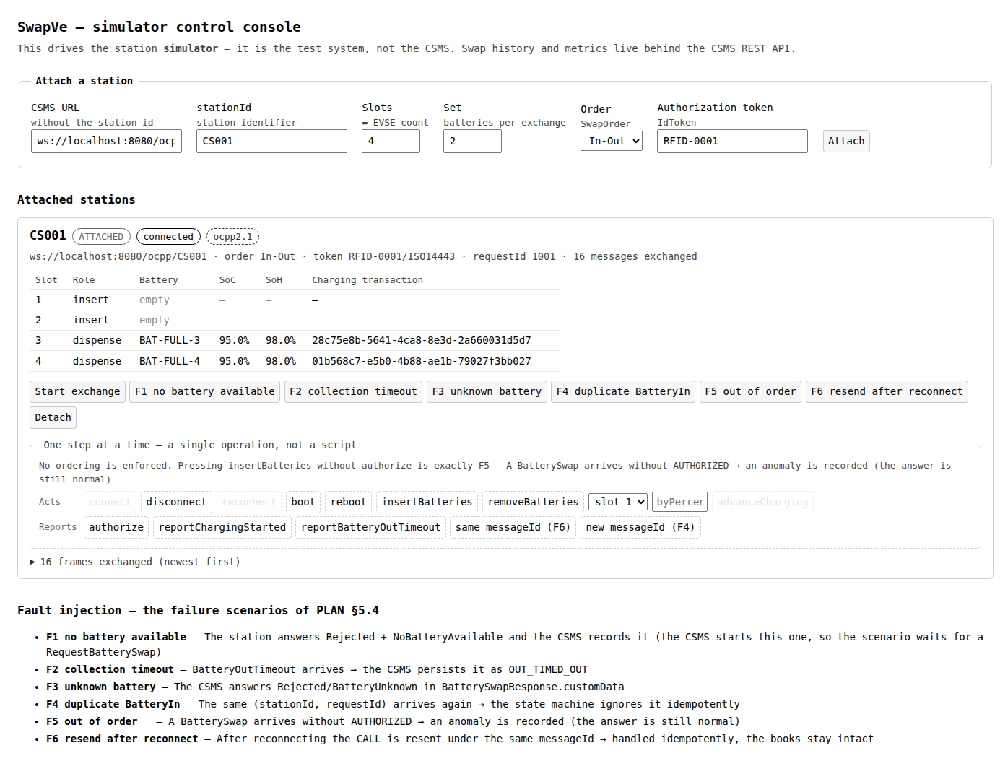
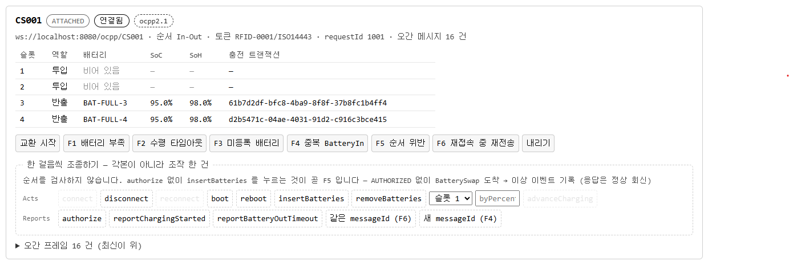
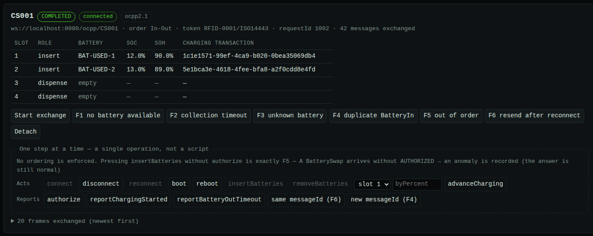
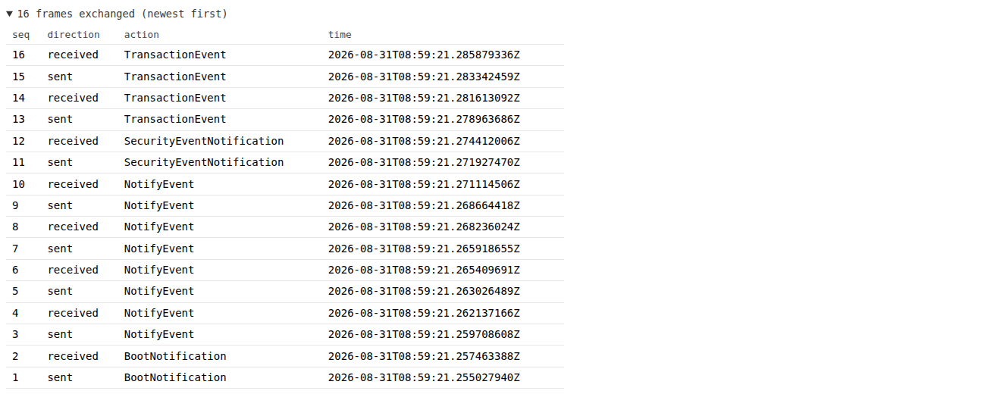
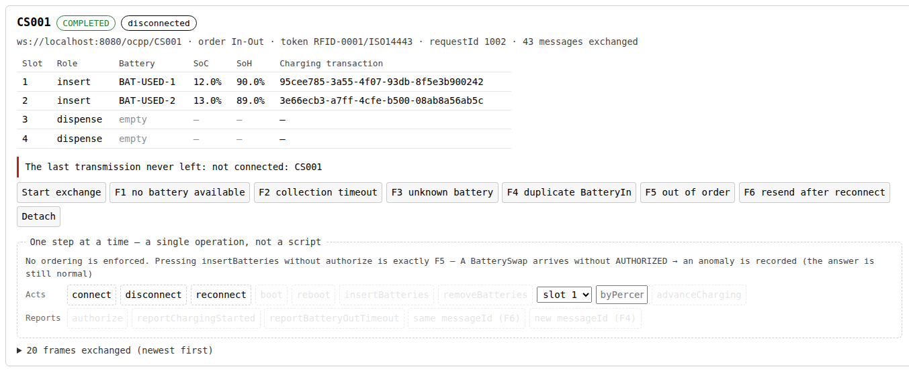

# The virtual station — what each simulator call actually does

> The question this document answers: **which of the simulator's calls are real, and which are
> convenience.**
>
> `StationSimulator` is not a script player. `runSwap()` has no behaviour of its own — it calls
> `authorize()`, `insertBatteries()`, `reportChargingStarted()`, `removeBatteries()` in an order
> chosen by `SwapOrder`, and nothing else. Every one of those is separately callable, and calling
> them in a different order, or leaving one out, is a supported thing to do. That is the difference
> between a station you can drive and a recording you can replay.



<sub>**The console is that station made visible.** The screen is still in Korean; reading it: the
header says *"SwapVe — simulator control console. This drives station simulators; it is not a
management server. Swap history and metrics live in the CSMS REST API."* The form attaches a station
— CSMS URL, stationId, slot count (`=EVSE`), set size, `SwapOrder`, authorization token. The
attached station sits below it, and at the foot of the page are the F1–F6 failure scenarios with
what each is expected to do. Localizing the runtime strings is still open.</sub>

---

## 1. Three layers of operation

The public surface splits into three kinds of call. The split is not enforced by types — it is a
statement about what a call *is*, and it is what tells you whether an operation is worth reaching
for individually.

**Acts** — physical events. An act changes a fact inside the station (a slot gains or loses a
battery, a battery's SoC rises, the connection opens or closes) and then announces the consequence
on the wire. The announcement follows the change; it does not substitute for it. An act does **not**
check that the surrounding scenario makes sense — see [§3](#3-there-is-no-ordering-gate-and-that-is-deliberate).

**Reports** — protocol statements. A report tells the CSMS something and changes no fact inside the
station. `authorize()` sends `AuthorizeRequest` and no slot moves. `reportBatteryOutTimeout()`
reports that a dispensed battery was never collected and deliberately leaves the slot occupied and
the charging transaction open — *the battery is still inside the station*, and the whole point of
S03.FR.06 is that the CSMS is left holding an orphan `BatteryIn`. A report does **not** make the
thing it reports true.

**Scripts** — ordered bundles of the first two. A script has no behaviour that isn't in the calls it
makes. It exists so the common path is one line. A script does **not** give you anything you cannot
assemble yourself, and it is never the only way to reach a state.

Why you need the distinction: when you want to test a CSMS against something the happy path doesn't
produce, you need to know **which call is the smallest unit that moves the world** and which call is
merely a macro over four other calls. Reaching for an act gets you a real, isolated event. Reaching
for a script gets you the whole sequence or nothing.

A fourth group, **observations**, is read-only and covered in [§4](#4-observation-is-derived-from-the-event-log).

## 2. Where every operation sits

All 24 public functions and 7 public properties of `StationSimulator`, with nothing left out.

### Acts — change a fact, then announce it

| Operation | What changes inside the station | What goes on the wire |
|---|---|---|
| `connect()` | transport opens | WebSocket handshake to `{csmsUrl}/{stationId}`, offering `ocpp2.1` then `ocpp2.0.1` and taking whichever the server picks |
| `disconnect()` | transport drops; session, slots, and `requestId` survive | nothing — the socket just closes |
| `reconnect()` | transport reopens on the same session and slots | handshake only |
| `close()` | session closes and transport drops; the simulator is finished | nothing |
| `boot()` | a charging transaction opens on every occupied slot | `BootNotification` → `NotifyEvent` per slot → `SecurityEventNotification(StartupOfTheDevice)` → `TransactionEvent(Started)` per occupied slot |
| `reboot()` | connection drops; every slot's transaction id, `seqNo`, and suspension are cleared — **batteries stay put** | disconnect, reconnect, then the boot sequence with `LocalReset` and `ResetOrReboot`, opening **new** transaction ids (S04.FR.11) |
| `insertBatteries()` | `config.insertSlots` gain `config.incomingBatteries`; a transaction opens per slot | `NotifyEvent(Occupied)` + `TransactionEvent(Started)` per slot, then one `BatterySwap(BatteryIn)` carrying the whole set |
| `removeBatteries()` | `config.dispenseSlots` lose their batteries; their transactions close | `TransactionEvent(Ended)` + `NotifyEvent(Available)` per slot, then one `BatterySwap(BatteryOut)` — note the order is the reverse of insertion, per `TC_S_103_CSMS` |
| `advanceCharging(slotId, byPercent)` | the battery's SoC rises by `byPercent`, capped at `BatterySwapCtrlr.MaxSoc`; at the cap the slot becomes suspended | `TransactionEvent(Updated, MeterValuePeriodic)` with measurand `SoC`; on reaching the cap, one more with `EnergyLimitReached` / `SuspendedEVSE`. The transaction stays **open** |

### Reports — say something, change nothing

| Operation | What changes inside the station | What goes on the wire |
|---|---|---|
| `authorize()` | nothing | `Authorize`; raises if the CSMS answers anything but `Accepted` |
| `reportChargingStarted()` | nothing but the transaction `seqNo` | `TransactionEvent(Updated, ChargingStateChanged, Charging)` per inserted slot |
| `reportBatteryOutTimeout()` | **nothing** — the uncollected batteries stay in their slots with their transactions open | one `BatterySwap(BatteryOutTimeout)` carrying the uncollected batteries, so the CSMS knows *which* ones are orphaned (F2, S03.FR.06) |
| `resendLastBatterySwap(sameMessageId)` | nothing | the last outbound `BatterySwap` frame again. `true` re-sends the identical frame straight down the transport (F6, tests the CSMS's idempotency ledger); `false` re-sends the payload under a fresh messageId (F4, tests the CSMS's duplicate-`BatteryIn` handling) |
| `reportFullInventory()` | nothing | waits for an accepted `GetBaseReport`, then `NotifyReport` pages of 3 with rising `seqNo` and `tbc` on all but the last (B03) |

### Scripts — ordered bundles, no behaviour of their own

| Operation | Expands to |
|---|---|
| `runSwap()` | `authorize()`, then `insertBatteries()` → `reportChargingStarted()` → `removeBatteries()` (`IN_OUT`) or `removeBatteries()` → `insertBatteries()` → `reportChargingStarted()` (`OUT_IN`) |
| `bootAndSwap()` | `boot()` then `runSwap()` |
| `runRemoteSwap()` | `awaitRemoteStart()`, then insert/remove in `SwapOrder` order. **No `authorize()`** — under S02 the CSMS already authorized and the station only answered `Accepted` |
| `chargeUntilMaxSoc(slotId, stepPercent)` | `advanceCharging(slotId, stepPercent)` in a loop until the slot suspends; returns every SoC it reported |

### Observations — read-only

| Operation | Reads |
|---|---|
| `config` | the `StationSimConfig` this simulator was built from |
| `eventLog` | every frame sent and received, verbatim ([§4](#4-observation-is-derived-from-the-event-log)) |
| `isConnected` | whether the transport is open; `false` rather than throwing when there is none |
| `subprotocol` | whatever the server picked in the handshake, reported verbatim ([§3](#3-there-is-no-ordering-gate-and-that-is-deliberate)); `null` when there is no open transport |
| `lastTransmitFailure` | the reason the last attempted transmission never left the station, or `null` when it did; a successful transmission clears it ([§4](#4-observation-is-derived-from-the-event-log)) |
| `lastCallTimeout` | the reason the last CALL ended with no answer at all, or `null` when an answer came; distinct from `lastTransmitFailure` — the frame did go out ([§4](#4-observation-is-derived-from-the-event-log)) |
| `unsupportedActions` | the actions the peer answered `NotImplemented`/`NotSupported` to, in the order they were first sent ([§4](#4-observation-is-derived-from-the-event-log)) |
| `slotState(slotId)` | `EMPTY` or `HOLDS_BATTERY`, in domain vocabulary — `Available`/`Occupied` never leaves the wire boundary |
| `batteryAt(slotId)` | the battery in the slot, or `null` |
| `chargingTransactionAt(slotId)` | the slot's charging transaction id, or `null`. Unrelated to the swap's `requestId` |
| `isChargingSuspended(slotId)` | whether the slot hit `MaxSoc` and stopped. Says nothing about the transaction, which is still open |
| `repliesTo(messageId)` | how many inbound frames carry that messageId — how a resend is confirmed to have been answered |
| `awaitRemoteStart()` | suspends until an inbound `RequestBatterySwap` is **accepted**, then returns its `requestId`. Sends nothing; a rejected request does not wake it |

## 3. There is no ordering gate, and that is deliberate

Every runtime check in `StationSimulator` inspects a **physical fact about the station**, never the
order in which you called things. The complete list:

| Check | What it asks |
|---|---|
| `connect()`, `reconnect()`: `transport == null` | is there already a connection |
| `insertBatteries()`: `slot.battery == null` | is the slot empty |
| `advanceCharging()`, `removeBatteries()`: `checkNotNull(slot.battery)` | is there a battery to charge or dispense |
| `reportBatteryOutTimeout()`: `pending.isNotEmpty()` | is there actually an uncollected battery |
| `requireTransaction(slot)`: `checkNotNull(slot.transactionId)` | is a charging transaction running on this slot |
| `reportFullInventory()`: `pages.isNotEmpty()` | is there anything to report |
| `slotOf()`, `connectedTransport()` | does the slot exist; is there a connection |

Two more checks compare a **status the CSMS sent back** — `Accepted` from `BootNotification`, and
`Accepted` from `Authorize`. Those read the other party's answer. Neither is a gate on our own call
sequence.

So nothing stops you from calling `insertBatteries()` without ever calling `authorize()`. **That is
F5.** The whole of the F5 driver in `sim-console` is one line:

```kotlin
// 인가를 건너뛴다. authorize() 를 부르지 않는 것이 이 시나리오의 전부다.
FaultScenario.F5 -> simulator.insertBatteries()
```

The station does not object, because a real station with a stuck relay or a bad firmware build
would not object either. Refusing to send it would mean the CSMS can never be tested against it.





<sub>**The console says the same thing this section does.** Above the operation buttons it reads
*"순서를 검사하지 않습니다. authorize 없이 insertBatteries 를 누르는 것이 곧 F5 입니다"* — *the
order is not checked; pressing insertBatteries without authorize is exactly F5.* In the first
picture the dispense slots 3–4 hold `BAT-FULL-3/4` and **`insertBatteries` is enabled even though
`authorize` has never been pressed.** In the second the swap has completed: slots 1–2 now hold the
discharged `BAT-USED-1/2` (SoC 12% / 13%), the dispense slots are empty, and what is greyed out has
moved with them — `insertBatteries` and `removeBatteries` are out, `advanceCharging` is in. **What
the console disables tracks physical facts, never call order.**</sub>

What the CSMS does with it is the actual test: it **answers normally and records the anomaly**.
`BatterySwapResponse` has no field for refusing, so the response goes back clean and an
`AnomalyReason.NOT_AUTHORIZED` is written alongside it; the log replay likewise declines to open a
swap that arrived without authorization. `FailureScenarioTest` asserts both halves — that the
anomaly is recorded, *and* that the `BatterySwapResponse` came back with no CALLERROR frames
anywhere in the exchange.

**The negotiated subprotocol is not a gate either.** The station offers `ocpp2.1` first and
`ocpp2.0.1` second, and the server picks one; the result is reported verbatim through
`subprotocol` and nothing else in the simulator reads it. So a CSMS that answers `ocpp2.0.1` still
receives `BatterySwap` and the rest of the 2.1 swap vocabulary, because that is the interesting
test — what does *that* CSMS do when a 2.1-only message arrives on a connection it negotiated down?
Refusing to send it would answer the question with silence.

The same reasoning covers the other configuration-driven scenarios: F1 (no battery available) and F3
(unregistered battery) are reproduced by *how the station is configured*, not by a switch in the
simulator. The injection hook, `FaultInjection.failingAt`, exists for the one thing configuration
cannot express — a sequence that dies halfway through, which is F6.

## 4. Observation is derived from the event log

There are no status flags added for the benefit of tests. Everything a test wants to know about what
happened on the wire is derived from `eventLog`, which holds every frame in both directions
verbatim.



<sub>The columns are **seq · direction · action · time** (`보냄` outbound, `받음` inbound). Reading
up from the bottom: `BootNotification`, four `NotifyEvent` pairs, a `SecurityEventNotification`, then
`TransactionEvent`. **There is no outcome column** — that absence is the subject of the end of this
section.</sub>

`repliesTo(messageId)` is the smallest example: it counts inbound frames carrying a given messageId.
`resendLastBatterySwap(sameMessageId = true)` bypasses `OcppSession` — the session always mints a
fresh messageId, so a true resend cannot go through it — which means there is no pending
continuation to await. Rather than return the moment the bytes leave (and let a test pass even if
the resend never landed), it polls `repliesTo()` until the count rises.

Tests read the log the same way. The F5 test confirms the response came back by filtering the log
for inbound `BatterySwap` frames; the F3 test finds its rejection by reading the `customData` of the
response payload it recovers from the log. Nothing is asserted against a flag that the simulator set
about itself.

That the log is the only record is also what decides whether a half-finished insertion can be
recovered, and the answer depends on *where* it died. `insertBatteries()` reports each slot and opens
each charging transaction first, and sends one `BatterySwap(BatteryIn)` last; from outside, a failure
in either part is the same thrown exception. If the transport dies during the slot reports, the
`BatterySwap` frame was never built, nothing about it is in the log, and
`resendLastBatterySwap(sameMessageId = false)` fails outright — there is nothing to re-send, and
calling `insertBatteries()` again is refused because the slot now holds a battery. If instead the
transport dies on the `BatterySwap` itself, the slot reports and transactions already reached the
CSMS and the frame *is* in the log, because `OcppSession.emitRaw` records before
it transmits — a `TransmitOutcome.Gone` leaves behind a record of a frame that never left. Once the
line is back, `resendLastBatterySwap(sameMessageId = false)` re-sends that recorded payload under a
fresh messageId: the CSMS receives the same `requestId` and the same battery set, and because the
messageId is new the idempotency ledger does not intercept it. Both paths are pinned down in
`StationFailurePathTest`.

**Three fields are the exception to that rule.** The first exists because of the
write-before-transmit order just described. `OcppSession.emitRaw` records a frame *before* it goes out, so
`OcppEventRecord` has no outcome column and **the record of a frame that left and one that never
left are identical, character for character.** Nor can the difference be inferred from "no reply came
back" — that is indistinguishable from a CALL still in flight or timed out, and SEND and CALLRESULT
have no reply to begin with. So `StationSimulator.lastTransmitFailure` holds the reason the last
attempted transmission did not go out (`null` if it did), and a successful transmission clears it.
It is a **read-only observation**: nothing in the simulator, the console, or the API reads it to
refuse an operation. The moment anything does, it becomes an ordering gate and F5 — which requires
`insertBatteries()` to work without `authorize()` (§3) — dies.



<sub>The red line reads *"마지막 전송이 나가지 못했습니다: 연결되지 않았다: CS001"* — *the last
transmission did not go out: not connected: CS001.* It is the only thing on the screen that says so.
The event log above it recorded that `Authorize` frame exactly as it records a delivered one, and
the badge had to be driven to `끊김` (disconnected) before the operation buttons greyed out — the
badge answers whether a socket exists, not whether the last frame left. Reproduced the way
`SimConsoleControlTest` does it: `disconnect`, then `authorize`, over the console's REST API.</sub>

**A second field splits that absence in two.** `lastTransmitFailure` answers *the frame never left*;
`lastCallTimeout` answers *the frame left and nothing came back*. From outside they look like one
failure, but what follows them differs: a CALL that timed out did reach the wire, so the peer may
already have processed it, and the next move is a resend that has to be idempotent — the same ground
F6 covers from the other direction. When that happens `lastTransmitFailure` stays `null`, because nothing failed to go out.
The event log cannot tell the two apart either: `emitRaw` records before transmitting, and the
absence of a CALLRESULT is indistinguishable from a CALL still in flight. `lastCallTimeout` holds
only the last one and is cleared the moment an answer arrives — including a rejection or a
schema-invalid response, because the condition is *did an answer come*, not *did it succeed*. Same
read-only rule: nothing may consult it to refuse an operation, and the console prints it on its own
line rather than merging it with the line above, so the distinction survives to the screen.

**A third field follows the same rule, for a different absence.** `unsupportedActions` accumulates
every action the peer answered `NotImplemented` or `NotSupported` to. The log does hold that
CALLERROR, but it does not say what the simulator did with it — whether the scenario stopped there
or carried on — and that is the part worth reading. Only calls whose response body nobody reads are
carried on from: the slot-status `NotifyEvent`, `SecurityEventNotification`, `TransactionEvent` and
`NotifyReport` announce a fact the station already knows, and what happens next is decided locally
(`transactionId` and `seqNo` are the simulator's own, and `TransactionEventResponse.idTokenInfo` is
never read). `BootNotification` and `Authorize` read their `status` to decide what follows, and
`BatterySwap` is the exchange this tool exists to test — a rejection there is the scenario failing,
and is still an exception. So is any other error code on a tolerated call: `InternalError` means a
known action failed mid-handling, which is not the same claim as "I do not know this action".

Unlike `lastTransmitFailure`, this one **accumulates and is never cleared**. A transmission failure
can stop being true — the line comes back — so keeping only the last one avoids leaving a recovered
station looking broken forever. That a peer does not know an action does not stop being true within
a session, so there is nothing to clear on, and a repeat of the same action leaves one entry rather
than two. It is a **read-only observation** on the same terms as `lastTransmitFailure`: nothing may
read it to skip a later send. Remembering what the peer cannot do and going quiet about it is a test
harness adjusting itself to the answer it is supposed to be checking — if that answer is wrong,
nobody finds out.

## 5. Limits

**It has never been connected to physical hardware.** Almost every run in this repository is this
simulator against this CSMS. That is why `openTransport` is an injection point at all: the JDK has
no server-side WebSocket, so a fake CSMS cannot be stood up, and without that seam the simulator
would be testable *only* through the real CSMS — where a red test cannot tell you which side is
wrong.

It has been pointed at two third-party CSMS implementations by hand. The first is why
`unsupportedActions` exists ([§4](#4-observation-is-derived-from-the-event-log)): that peer answered
`SecurityEventNotification` with a "do not know this action" error and the whole boot sequence died
on it, so nothing after that point was ever attempted — including the swap the run was for. A tool
built to find out what a peer cannot do must not stop at the first thing the peer cannot do.

Once it no longer stopped there, the second peer — which negotiated `ocpp2.1` — took the boot
sequence, `Authorize`, `TransactionEvent` and the CALLERROR replies, and a `BatterySwap` frame
reached it and was refused for want of a schema. What each run confirmed, what it did not, and whose
side the obstacles were on is written out in
[CONFORMANCE.md](CONFORMANCE.md#limits-of-self-verification). Neither run is repeatable here:
both were manual, and nothing in this repository re-runs them.

**Four inbound actions are answered**, and only four: `RequestBatterySwap`, `GetVariables`,
`SetVariables`, `GetBaseReport`. Everything else returns `NotImplemented` per Part 4 §4.3, rather
than pretending.

**`GetBaseReport` accepts `FullInventory` only.** `ConfigurationInventory` and `SummaryInventory` are
different lists — configurable-only and summary-only. Answering all three with the same full list
would not be supporting three report bases; it would be answering two of them wrongly.

**Charging is not modelled.** `advanceCharging(slotId, byPercent)` raises SoC by exactly the step the
caller passed, capped at `MaxSoc`. There is no current, no taper, no temperature, no time-to-full. A
battery inserted above the cap is not pulled down to it — charging does not lower SoC, and rewriting
an observation would be a lie — it simply suspends immediately.

**`close()` is the end of that simulator.** It shuts down the `OcppSession` as well as the
transport, and the session's flag is one-way — it then refuses everything, inbound and outbound
alike. `connect()` and `reconnect()` refuse afterwards too, which is a lifetime check rather than
a protocol one: it asks whether the object is still usable, not whether the call sequence makes
sense. Without it, reconnecting after `close()` would succeed and leave you with a station that
reads as connected and cannot say a word.

`disconnect()` is the reversible one. It drops the socket and leaves the session, the slots and
the `requestId` intact, which is what a station coming back from a network gap looks like — and
what F6 exercises. The console does not expose `close()` as an operation for this reason: it ends
stations by discarding them.

**There is no real time.** Every timestamp comes from the injected `Clock` and every step waits for
the peer's CALLRESULT. There is no `sleep` anywhere, so "ten minutes later" is produced by moving the
clock, and runs are deterministic.

---

> This document is about **simulator operations** — what a call does to the station and what it puts
> on the wire. For **module boundaries** — how much of `ocpp-core` you can take, and what you take on
> when you do — see [LAYERS.md](LAYERS.md).
